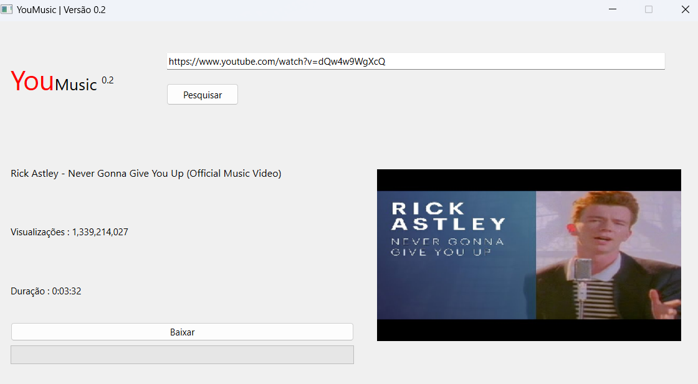

# YouMusic

### Download Link : 

#### - https://mega.nz/file/OS4gxbAD#xfSJiC3I9LVVzU5I_HeiurGdKs030AT9s74uSm0i_AY




> Com a versão 0.2 de YouMusic, você poderá baixar músicas (MP3) apenas com o link do Youtube, com o programa poderá ser utilizado tanto para baixar músicas quanto
para baixar áudios para usar em Pads ou outros fins.

### Ajustes e melhorias

YouMusic encontra-se na versão 0.2, portanto novas funcionalidades serão adicionadas :

- [x] Baixar Músicas ( MP3 ) Em Alta Qualidade
- [x] Confirmar ( Mostrar Informações atuais do vídeo )
- [ ] Definir local padrão para baixar
- [ ] Realizar Pesquisar apenas com Nomes
- [ ] Realizar Melhoramento de Design Geral


## 🚀 Instalando YouMusic

Para instalar o YouMusic, siga estas etapas:

Linux e macOS:
```
 Apenas Descompacte o arquivo e inicie YouMusic.Exe
```

Windows:
```
 Apenas Descompacte o arquivo e inicie YouMusic.Exe
```

## 🤔 Como usar

Usando Como referência a imagem acima : 

```
 1. Insira o Link (Youtube) que deseja
 2. Clique em pesquisar com isso será exibido informações sobre o vídeo
 3. Clique em BAIXAR para realizar o DOWNLOAD do Vídeo em formato MP3
```

## Obrigado por usar o YouMusic !
